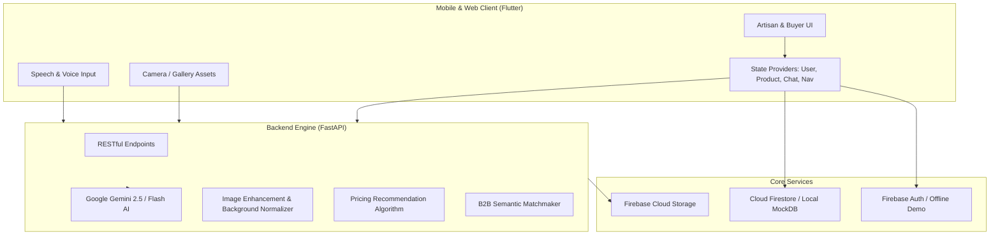

# 🪷 ShilpSetu AI (शिल्पसेतू)

> **Empowering Indian Artisans: From Traditional Craftsmanship to Global Digital Markets.**

[](https://flutter.dev)
[](https://dart.dev)
[](https://fastapi.tiangolo.com)
[](https://python.org)
[](https://ai.google.dev)
[](https://firebase.google.com)
[]()
[](LICENSE)

---

## 📖 Executive Summary

**ShilpSetu AI** is an AI-powered virtual business ecosystem tailored specifically for rural and traditional Indian artisans. It bridges the digital divide by transforming handmade physical crafts into export-ready digital catalogs, ensuring transparent pricing, and linking craftspeople directly to verified B2B buyers and global exporters without intermediaries.

Built with **accessibility-first design**, ShilpSetu supports regional languages (**Marathi, Hindi, and English**), speech-to-catalog generation, and an audio identity reader so artisans with low digital literacy can seamlessly run and grow their enterprises.

---

## 🌟 Key Pillars & Features

### 🏺 1. For Artisans (कारागीर / शिल्पकार)
- **🎙️ Voice-to-Catalog**: Speak in native dialects (Marathi, Hindi, English). The multi-modal AI extracts craft dimensions, materials, history, and craft traditions into professional listings automatically.
- **📸 AI Photo Studio**: Automatically removes cluttered workshop backgrounds, corrects studio lighting, and generates high-converting white-background and editorial product showcases.
- **💰 Smart Fair Pricing Engine**: Recommends ethical market rates based on raw material costs, hours of artisan labor, historical benchmarks, and Geographical Indication (GI) value tags.
- **🪪 Digital Pehchan Card**: Official digital artisan ID verified with government registries, featuring QR shareable portfolios and a one-tap audio profile reader (`🔊 बोलून दाखवा`).
- **🏛️ Government Schemes Integration**: Direct awareness and application guidance for **PM Vishwakarma**, **ODOP (One District One Product)**, **GI-Tag Heritage Protection**, and cluster grants.
- **🤝 Direct Buyer Leads**: Real-time notifications of purchase inquiries and custom orders from corporate and bulk retail buyers.

### 🏢 2. For B2B Buyers & Exporters
- **🔍 Verified Craft Discovery**: Source authentic GI-certified handloom, pottery, metal crafts, and wooden artifacts directly from the makers.
- **📊 AI Smart Matchmaking**: Algorithmic scoring that pairs buyer order requirements with artisans possessing matching inventory and capacity.
- **📦 Bulk Inquiries & Quotes**: Seamless quotation system with transparent breakdown and sample requests.
- **💬 Real-Time Chat**: Direct communication with translation assistance to overcome regional language barriers.

### 🏛️ 3. For Admins & Cooperative Clusters
- **📈 Cluster Analytics**: Track regional artisan onboardings, sales volume, top-performing craft clusters, and fulfillment rates.
- **🎪 Digital Mela (डिजिटल मेळा)**: Organize and host virtual exhibitions and seasonal craft fairs where artisans broadcast live craft demonstrations.

---

## 🏗️ System Architecture



---

## 📱 Tech Stack

| Layer | Technology | Details |
|---|---|---|
| **Mobile Frontend** | Flutter & Dart 3 | Cross-platform (Android, iOS, Web) |
| **State Management** | Provider | Reactive state architecture |
| **Routing** | GoRouter | Declarative routing with role-based guards |
| **Backend Framework** | FastAPI (Python 3.10+) | High-performance asynchronous REST API |
| **Generative AI** | Google Gemini (2.5 / Flash) | Multimodal cataloging, vision analysis, & pricing logic |
| **Cloud & Auth** | Firebase | Authentication, Cloud Firestore, Cloud Storage |
| **Design System** | Custom ShilpSetu Theme | Heritage Earth tones, Material 3, High Accessibility |
| **Localization** | Trilingual Engine | English, मराठी (Marathi), हिंदी (Hindi) |

---

## 📂 Project Structure

```
ShilpSetu_AI/
├── mobile_app/                          # Flutter Mobile Client
│   ├── android/                         # Android native configurations & launcher icons
│   ├── assets/images/                   # Brand logos and vector graphics
│   └── lib/
│       ├── core/
│       │   ├── constants/               # Localization strings & craft palettes
│       │   ├── providers/               # UserProfile, Product, Chat, Navigation
│       │   ├── services/                # AuthService, AIService, API clients
│       │   └── theme/                   # AppTheme & Indian Heritage Color System
│       ├── features/
│       │   ├── admin/screens/           # Admin cluster oversight dashboard
│       │   ├── artisan/screens/         # Home dashboard, Profile & Pehchan Card
│       │   ├── auth/screens/            # Splash, Welcome, Login, Role Selector
│       │   ├── buyers/screens/          # B2B Buyer Portal, Leads, & Matching
│       │   ├── chat/screens/            # Buyer-artisan live messaging
│       │   ├── digital_mela/screens/    # Virtual artisan exhibition & stalls
│       │   └── products/screens/        # AI Studio, Voice Cataloger, Smart Pricing
│       └── main.dart                    # Application bootstrap & router
│
├── backend/                             # FastAPI Backend Engine
│   ├── app/
│   │   ├── ai/                          # Gemini AI providers & prompt templates
│   │   ├── api/                         # Product, Artisan, Buyer, & Mela routes
│   │   ├── database/                    # Firestore client & fallback mock store
│   │   ├── models/                      # Pydantic validation schemas
│   │   ├── services/                    # Pricing, Enhancement, & Matching logic
│   │   └── main.py                      # FastAPI app entry point
│   ├── requirements.txt                 # Python dependencies
│   └── .env                             # Environment variables configuration
│
└── README.md                            # Complete Project Documentation
```

---

## 🚀 Getting Started

You can run ShilpSetu AI in two modes:
1. **Interactive Demo Mode** (Default — No external credentials or keys required)
2. **Production Cloud Mode** (Full Firebase Authentication, Cloud Firestore, & Live Gemini AI)

### Prerequisites
- [Flutter SDK](https://docs.flutter.dev/get-started/install) (v3.19.0 or higher)
- [Python](https://www.python.org/downloads/) (v3.10 or higher)
- Android Studio / VS Code with Flutter extension
- A connected physical Android device or emulator

---

### Step 1: Clone the Repository
```bash
git clone https://github.com/sunnygaikwad-web/Dukaan_AI.git ShilpSetu_AI
cd ShilpSetu_AI
```

---

### Step 2: Setup and Run the Backend

```bash
cd backend

# Create virtual environment
python -m venv venv

# Activate virtual environment
# Windows:
venv\Scripts\activate
# macOS/Linux:
source venv/bin/activate

# Install dependencies
pip install -r requirements.txt

# Start the server (Demo mode enabled by default)
uvicorn app.main:app --reload --host 0.0.0.0 --port 8000
```
Verify the backend by visiting `http://localhost:8000/docs` to explore the interactive Swagger documentation.

---

### Step 3: Setup and Run the Mobile App

```bash
cd ../mobile_app

# Fetch Flutter dependencies
flutter pub get

# Check connected devices
flutter devices

# Run on your connected device or emulator
flutter run
```

---

## 🔑 Cloud & Production Configuration (Optional)

To enable live Google Cloud services and production Firebase:

### 1. Firebase Setup
1. Open the [Firebase Console](https://console.firebase.google.com).
2. Create a project named `shilpsetu-ai`.
3. Register an Android app with package name: **`in.gov.shilpsetu.shilpsetu_ai`**.
4. Download `google-services.json` and place it in:
   `mobile_app/android/app/google-services.json`
5. Enable **Authentication** (Email/Password & Phone).
6. Enable **Cloud Firestore** and **Firebase Storage** in Test or Production mode.

### 2. Gemini AI API Key
1. Obtain an API key from [Google AI Studio](https://aistudio.google.com/).
2. Add your credentials to `backend/.env`:
```env
AI_MODE=live
AI_PROVIDER=gemini
AI_API_KEY=AIzaSyYourGeminiApiKeyHere
```

---

## 📱 User Demo Journeys

### Artisan Persona Journey
```
Launch App ──> Select Language (मराठी / हिंदी / English)
   └──> Artisan Dashboard (Real-time sales, live crafts, leads)
   └──> Tap "Add Craft" (+)
   └──> AI Photo Studio (Select craft photo ──> AI Enhances lighting & removes backdrop)
   └──> Voice Cataloger (Speak: "ही पैठणी साडी शुद्ध रेशमी धाग्यांनी हातमागावर विणलेली आहे...")
   └──> AI generates trilingual descriptions + tags + GI certificate details
   └──> Smart Pricing suggests optimal wholesale & retail price
   └──> Publish Craft ──> Live in Digital Mela & B2B Buyer Feeds
```

### B2B Buyer Persona Journey
```
Sign in as Buyer (or switch role to Buyer)
   └──> B2B Sourcing Portal
   └──> Filter by craft category (Handloom, Terracotta, Metalwork, Woodcraft)
   └──> View verified artisan profiles & Pehchan ID
   └──> Submit Bulk RFQ (Request for Quote)
   └──> Real-time negotiation via direct chat
```

---

## 🌐 API Reference Overview

| HTTP Method | Endpoint | Description |
|---|---|---|
| `GET` | `/` | API Healthcheck & current operational mode |
| `POST` | `/api/products/generate-catalog` | AI Multimodal catalog creation from voice + photo |
| `POST` | `/api/products/recommend-price` | AI Pricing recommendation with market justification |
| `POST` | `/api/products/enhance-image` | Background cleanup and studio lighting enhancement |
| `POST` | `/api/products` | Publish and save product to registry |
| `GET` | `/api/products` | Retrieve active craft catalog |
| `POST` | `/api/buyers/match` | Semantic compatibility matching for buyers |
| `GET` | `/api/buyers/recommended` | List verified active B2B buyers |
| `POST` | `/api/buyers/bulk-order-request` | Submit customized bulk procurement inquiry |
| `GET` | `/api/artisans/{id}` | Retrieve verified artisan profile & Pehchan ID |
| `GET` | `/api/digital-mela` | Fetch upcoming virtual exhibitions & stalls |

---

## 🤝 Contributing

Contributions are welcome! Please follow these guidelines:
1. Fork the Project repository.
2. Create your Feature Branch (`git checkout -b feature/CraftFeature`).
3. Commit your changes (`git commit -m 'feat: add voice support in Gujarati'`).
4. Push to the Branch (`git push origin feature/CraftFeature`).
5. Open a Pull Request.

---

## 📄 License

Distributed under the **MIT License**. See `LICENSE` for more information.

---

<p align="center">
  <b>शिल्पसेतू — पारंपारिक कारागिरांचा डिजिटल सेतू 🪷</b><br>
  <i>Empowering artisans, preserving heritage, and scaling indigenous craft economies.</i>
</p>
